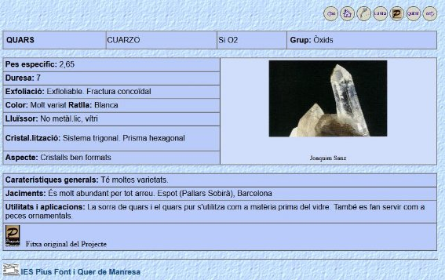

![ref1]![ref2]Generalitat de Catalunya

**Departament d’Educació**

![ref3]![ref3]![ref4]

**ASIX1 / DAW M04: llenguatges de marques UF2: àmbits d’aplicació de l’XML A02.03pi pràctica XSLT**

![ref4]![ref4]

|**Revisió**|**Data**|**Autor**|**Observacions**|
| :- | :- | :- | :- |
|||||
|0|09/01/2023|Josep Bassó|Document inicial|
|||||
|1|05/02/2023|Josep Bassó|Revisió / actualització|
|||||

**OBJECTIUS**

![ref5]

2\.1 Identifica la necessitat de la conversió de documents XML.

2\.2 Estableix àmbits d’aplicació de la conversió de documents XML.

2\.3 Analitza les tecnologies implicades i la seva manera de funcionament.

2\.4 Descriu la sintaxi específica utilitzada en la conversió i adaptació de documents XML.

2\.5 Crea especificacions de conversió.

2\.6 Identifica i caracteritza eines específiques relacionades amb la conversió de documents XML.

2\.7 Realitza conversions amb diferents formats de sortida.

2\.8 Documenta i depura les especificacions de conversió.

**INSTRUCCIONS**

![ref5]

- Llegeix amb calma què s'ha de fer abans de començar.

- Lliura només un sol fitxer amb el nom: **A02\_03pi\_*cognom*\_*nom***.
- En cas de lliurar més d’un document, els has de comprimir amb **zip** o **rar**.
- Els documents han de ser amb format **xsl**.
- L’incompliment d’un punt anterior pot provocar la no correcció.
- El professor pot demanar l’explicació del treball realitzat.
- En cas de còpia la nota serà un 1 a la UF per tots els implicats.

**AVALUACIÓ**

![ref5]

●	Cada exercici et mostra la seva valoració màxima.

![ref1]![ref2]Generalitat de Catalunya

**Departament d’Educació**

**PRÀCTICA**

![ref5]

Pots fer servir l’XML Copy Editor o altres avaluadors, per exemple:

<https://www.freeformatter.com/xsl-transformer.html>

Us facilitarà molt la pràctica disposar d’un servidor (XAMPP, …).

La pràctica es realitzarà a partir del fitxer adjunt **minerals\_simple.xml**

**Apartat 1: fitxa.**	**minerals\_fitxa.xsl**	**(5p)**

Fes un fitxer xsl per tal d’obtenir, aproximadament, la següent fitxa.

Pots fixar el mineral que vulguis, p.ex. QUARS (només se’n mostrarà un).

Tingues present les dades del fitxer XML (la fitxa no serà completa).

Basa’t en el codi HTML al fitxer codi\_fitxa.html. Revisa quines parts has de canviar i posar-hi el codi XSLT.

Per posar valor a atributs pots mirar la referència d’elements XSLT:

<https://www.w3schools.com/xml/ref_xsl_el_attribute.asp>

![ref1]![ref2]Generalitat de Catalunya

**Departament d’Educació**

OUTPUT

CODI

[Accés al Github: minerals_fitxa.xsl](https://github.com/elRohit/ASIX/blob/main/ASIX1/LL.%20DE%20MARQUES/UF2%20-%20ÀMBITS%20D'APLICACIÓ%20D'XML/ACTIVITAT2%20-%20XSLT/xsl/minerals_fitxa.xsl) 

**Apartat 2: llistats.**

**2.1. Llistat ordenat.**	**minerals\_llista\_21.xsl**	**(1p).**

Fes un fitxer xsl per tal d’obtenir, aproximadament, el següent llistat.

Ordena els elements per *Grup* de forma descendent i després per



*Id*



ascendent.

OUTPUT

CODI

[Accés al Github: minerals_llista_21.xsl](https://github.com/elRohit/ASIX/blob/main/ASIX1/LL.%20DE%20MARQUES/UF2%20-%20ÀMBITS%20D'APLICACIÓ%20D'XML/ACTIVITAT2%20-%20XSLT/xsl/minerals_llista_21.xsl) 

|**2.2. Llistat ordenat d’un grup.  minerals\_llista\_22.xsl**|**(1p).**|
| :- | :- |

A partir de l’apartat anterior, escriu un fitxer xsl perquè només es mostrin els elements del grup “Sulfurs”.

OUTPUT

CODI

[Accés al Github: minerals_llista_22.xsl](https://github.com/elRohit/ASIX/blob/main/ASIX1/LL.%20DE%20MARQUES/UF2%20-%20ÀMBITS%20D'APLICACIÓ%20D'XML/ACTIVITAT2%20-%20XSLT/xsl/minerals_llista_22.xsl) 

**2.3. Llistat ordenat amb colors.**	**minerals\_llista\_23.xsl**	**(1p).**

A partir del llistat de l’apartat 2.1, escriu un fitxer xsl perquè a cada fila es mostri el color indicat (quan només n’hi hagi un).

Per exemple: Blanc, negre, Blau, gris i Groc; la resta es mostraran d’un altre color.

OUTPUT

CODI

[Accés al Github: minerals_llista_23.xsl](https://github.com/elRohit/ASIX/blob/main/ASIX1/LL.%20DE%20MARQUES/UF2%20-%20ÀMBITS%20D'APLICACIÓ%20D'XML/ACTIVITAT2%20-%20XSLT/xsl/minerals_llista_23.xsl) 

**2.4. Llistat ordenat amb apply-templates.	minerals\_llista\_24.xsl**	**(2p).**

A partir de llistat de l’apartat 2.1, escriu un fitxer xsl per tal que cada columna tingui un

color de fons i de lletra diferent de les altres.

Fes servir servir apply-templates.

OUTPUT

CODI

[Accés al Github: minerals_llista_24.xsl](https://github.com/elRohit/ASIX/blob/main/ASIX1/LL.%20DE%20MARQUES/UF2%20-%20ÀMBITS%20D'APLICACIÓ%20D'XML/ACTIVITAT2%20-%20XSLT/xsl/minerals_llista_24.xsl) 

[ref1]: Aspose.Words.9834046b-3ee5-4edb-9a8b-72bb2eeb7797.001.jpeg
[ref2]: Aspose.Words.9834046b-3ee5-4edb-9a8b-72bb2eeb7797.002.jpeg
[ref3]: Aspose.Words.9834046b-3ee5-4edb-9a8b-72bb2eeb7797.003.png
[ref4]: Aspose.Words.9834046b-3ee5-4edb-9a8b-72bb2eeb7797.004.png
[ref5]: Aspose.Words.9834046b-3ee5-4edb-9a8b-72bb2eeb7797.005.png
